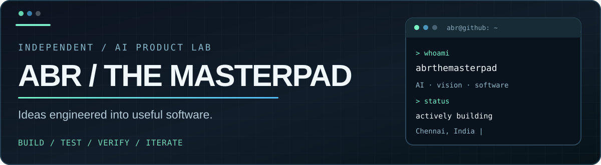

  

   

  **Building practical AI systems, useful software, and independent product experiments.**

  
  
  

---

### About this builder

I'm an independent builder exploring **local-first AI, computer vision, evidence-backed research, and practical product workflows**.

I prefer verified capabilities over inflated claims, human review over uncontrolled automation, and affordable infrastructure over unnecessary complexity.

  
<strong>▶ View my ASCII GitHub identity card (gh-ascii)</strong>

  

    
  

  This optional live card uses the third-party <a href="https://github.com/crafter-station/gh-ascii">gh-ascii</a> service. If the image is unavailable, <a href="https://gh.crafter.run/">generate a downloadable SVG</a> instead. Public statistics may be incomplete or cached.

### Selected work

| Build | What I'm exploring | Visibility / maturity |
|:--|:--|:--|
| **[GINI](https://github.com/abrthemasterpad/Gini)** | Local-first camera AI assistant: PTZ, microphone, speaker, and vision. | **Public source** · hardware paths verified; autonomy experimental |
| **ARIA** | Prospect intelligence, independent evidence, and human approval workflows. | Private development |
| **TRACE** | Evidence-led investigation: claims, contradictions, uncertainty, follow-ups. **Not lie detection.** | Private development |
| **XSIGHT** | Retail camera analytics and operational digital-twin experiments. | Private development |
| **ResQue Sales** | Evidence-based sales coaching and performance-recovery workflows. | Private development |
| **Pilot** | Content planning and AI-assisted publishing preparation. | Private development |
| **im-mortal** | Autonomous-agent economics, experiments, and verification gates. | Private experiment |

**Featured open-source project: [Gini →](https://github.com/abrthemasterpad/Gini)**

Gini explores turning a low-cost pan/tilt camera into a physical local assistant. The repository documents observed camera video, PTZ control, microphone, speaker/talkback, and speech pipelines, while distinguishing experimental AI components from verified hardware capabilities.

### Technology stack

### How I build

- **Evidence before conclusions.** Repeated AI guesses are not independent proof.
- **Human approval at risk boundaries.** No autonomous purchases, access changes, or unreviewed outreach.
- **Privacy from day one.** Secrets, tenant boundaries, and least-privilege access matter.
- **Prove locally.** Run tests and disclose unverified functionality.
- **Cost discipline.** Prefer local-first or free-tier infrastructure where practical.

### Explore

[Public repositories](https://github.com/abrthemasterpad?tab=repositories) · [Gini technical notes](https://github.com/abrthemasterpad/Gini) · [Portfolio website source](https://github.com/abrthemasterpad/Abr-the-Masterpad)

---

  ABR / THE MASTERPAD · Independent AI Product Lab · Chennai, India
   
  GPRM-style presentation inspired by <a href="https://gprm.itsvg.in/">GPRM</a>. ASCII identity card by <a href="https://github.com/crafter-station/gh-ascii">gh-ascii</a>.

